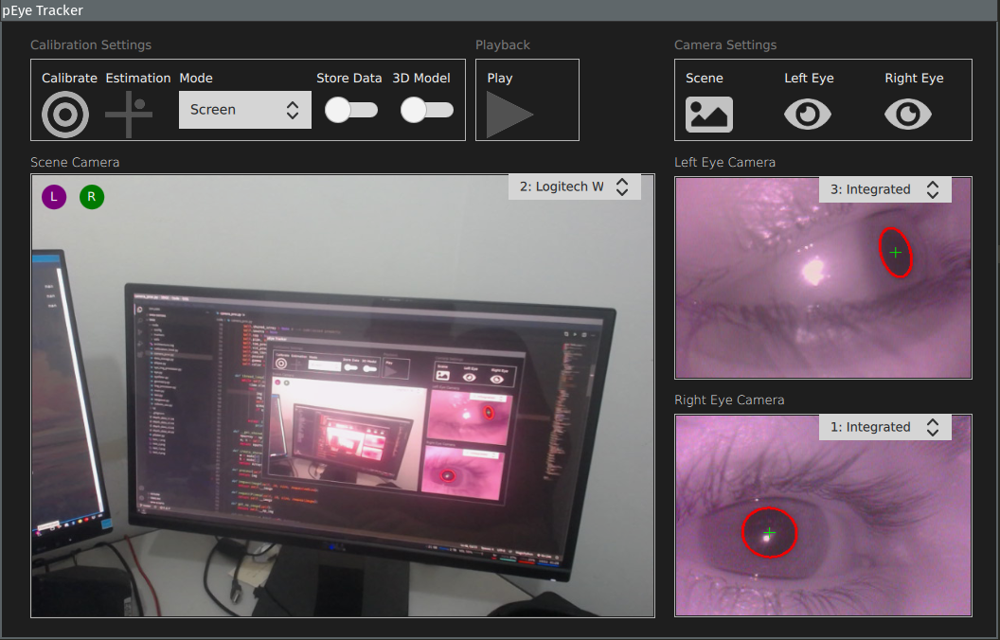
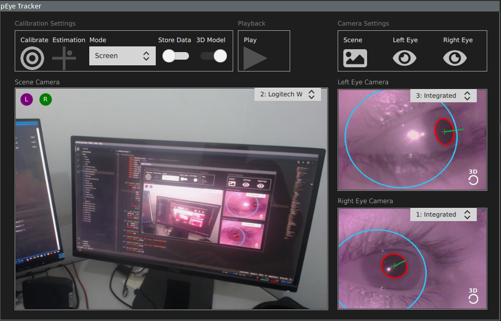

# pEyeTracker

pEyeTracker is an experimental and cross-platform eye-tracking software written in Python 3. It was designed to primarily work with the [Core cameras](https://pupil-labs.com/products/core/) from Pupil Labs, but it should work with any **head-mounted setup** with UVC-compliant cameras.

 


### Features

pEyeTracker has some similar functionalities found in older versions of [Pupil Capture](https://github.com/pupil-labs/pupil), but it is definitely not a replacement. If you are looking for a feature-rich eye-tracking software for your UVC cameras, you should stick with Pupil Capture. However, pEyeTracker does have some features that might be particularly interesting for developers:

* virtually no dependency hell
* user interface in QML, decoupled from the eye-tracking code
* architecture is modular and object-oriented
* readable and documented code
* cross-platform (same code runs from source on Windows, Mac, and Linux)
* support for the old 30 Hz binocular Pupil cams

Additionally, pEyeTracker offers some basic functionalities found in similar software (though many others are still missing :sob:):

* 2D calibration for each eye
* 3D calibration for each eye
* calibration accuracy measurement
* eye video loading
* gaze data storage
* gaze estimation feedback on interface


### Dependencies

* NumPy
* OpenCV 4
* pyuvc
* PySide2
* scikit-learn
* pupil-detectors
  

### Installation and running

pEyeTracker has no packaging (yet), which means that you should run it from source. But first, let's install the dependencies:

```
pip install -r requirments.txt
```

Please note that ``pyuvc`` is not listed in PyPI, so you *may* have to install it manually. Look [here](https://github.com/pupil-labs/pyuvc/releases) for further instructions. 

Assuming that all went well, access the ``src`` folder and start up pEyeTracker with:

```
python3 main.py
```


### Collaboration

As stated before, pEyeTracker is at an experimental stage. Unfortunately, I can only work on it at my spare time, so any help with debugging, adding new useful features, or re-writting a problematic module would be greatly appreciated. 

If you feel like collaborating, just get in touch or make a pull request with your changes. I will gladly look at it as soon as I can.

Some of the things I think should be implemented at some point in the future:

* [ ] a state-of-the-art pupil tracking algorithm (replacing `pupil-detectors` dependency)
* [ ] improved support for 3D eye model and eyeball localization
* [ ] provide some useful eye behavior data, such as:
    * [ ] number of fixations, saccades, and smooth pursuit events
    * [ ] blinks
    * [ ] fixation duration
    * [ ] saccade length
    * [ ] average, min, and max pupil diameter
* [ ] support vergence movement detection
* [ ] stream gaze data through some network protocol
* [ ] option to change calibration parameters on UI
* [ ] option to change gaze estimation function and its paramenters on UI


### Issues

If you need support, just create a new issue. I'll do what I can to help as soon as possible. Please, bear in mind, though, that pEyeTracker is an experimental software with no guarantees or dedicated support. 
